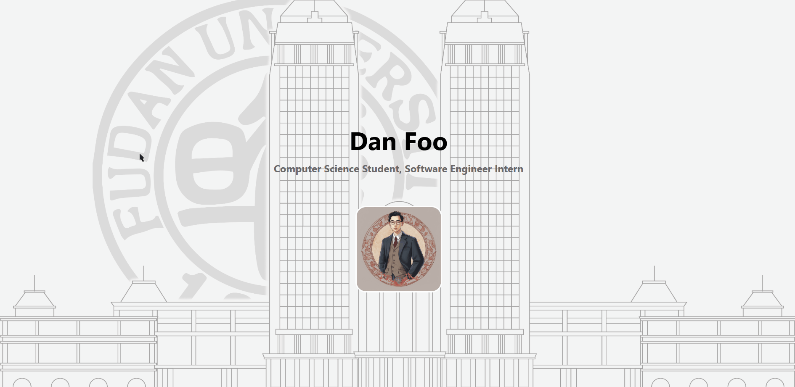

# ✉️ AWS-Resume
Online resume hosted with AWS S3, CloudFront and Route53.

Final project for Fudan University "Cloud Computing and Virtualization Technologies" course. 

 

## Demo

 

## Features 
- Frontend design with HTML and CSS
- Online resume hosted in `AWS S3` bucket
- Use `AWS CloudFront` for global content distribution (edge location, improved latency and security).
- Setting up custom domains with `AWS Route53` (improves accessibility)
- IAM setup with permissions for S3, CloudFront, Route 53.

 

## Usage

 

## Other Documentation
- Course Thesis: [PDF](./docs/)
- Presentation Slides: [PDF](./docs/)
- Chinese version `README.md`: [README_CN.md](./README_CN.md)